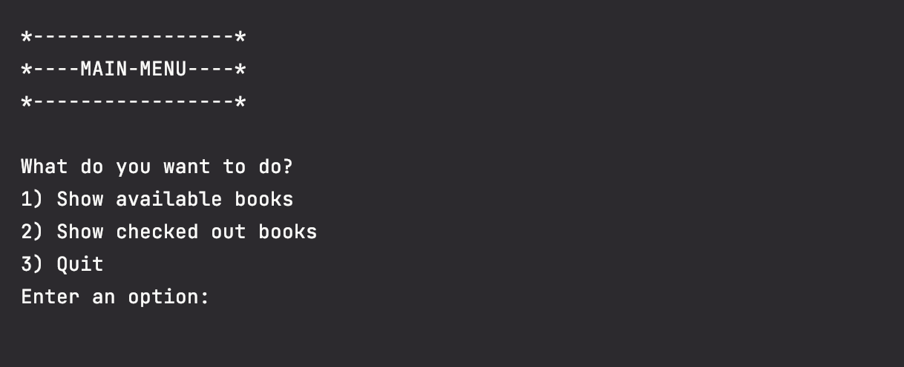
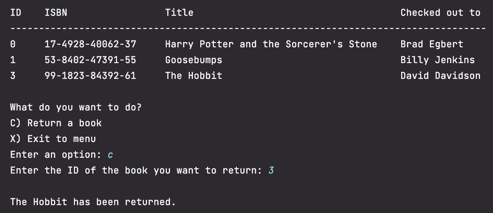

# NeighborhoodLibrary

This application allows you to check books in and out in a virtual library.

Users have the ability to:
1. List all available books
2. List all checked out books
3. Check out books that are available
4. Return books that are currently checked out

### Home Screen

### Checking out books
NOTE: Cannot check out books that have already been checked out

### Returning books
NOTE: Cannot return books that are currently available

